# JavaScript Charts Performance Test Suite

This test suite demonstrates the performance of several JavaScript Chart libraries in a variety of test cases, 
to determine which perform the best under demanding and varied conditions.

## What Chart Libraries are tested? 

This Test suite performs JavaScript Chart stress tests and compares the following libraries:

- SciChart.js
- HighCharts (with Boost module)
- Plotly.js (with GL series types where available)
- Chart.js
- Apache eCharts (with GL series types where available)
- uPlot

> Care has been taken to ensure the latest version of libraries are used, and tests are fair and equitable where feature differences or API differences occur between the libraries.  
> For example: Data is generated in the same manner, all test cases use Float64 data and all tests aim to minimise GC load by re-using data arrays passed to the charts.
> 
> FPS (Frames per second) is measured in the same manner for all libraries / test cases using `requestAnimationFrame` and `performance.now` and memory usage is reported using `window.performance.memory?.usedJSHeapSize`

## What Test Cases are carried out?

This test suite aims to test a variety of JavaScript Chart operations with a variety of test cases, including Line, Scatter, Column, Candlestick, Heatmap, as well as 3D Chart (Surface mesh/plot, 3D point cloud) and multi-chart cases.

A full list of test cases carried out and their descriptions can be found below:

### N line series M points Test

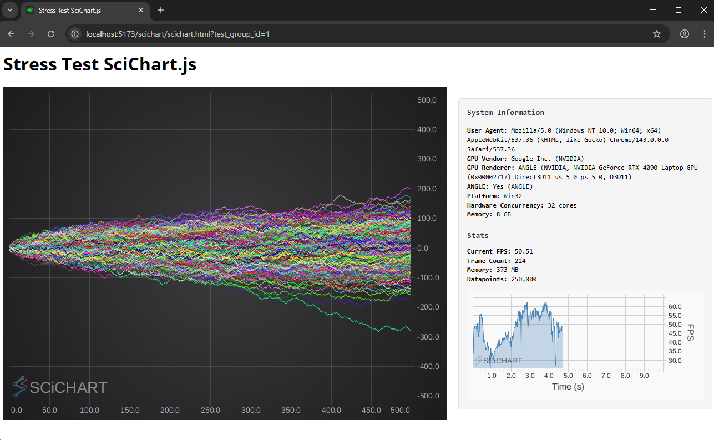

Multi-line test case for monte carlo simulation style charts. Starting with 100 line series x 100 data-points per series,
the test is incrementally updated to 200x200, 500x500, 1000x1000, 2000x2000 and 4000x4000. 

This test case stresses the static overhead of adding a line series and drawing to a chart, while dynamically varying the zoom to measure the update rate.

### Brownian Motion Scatter Series Test

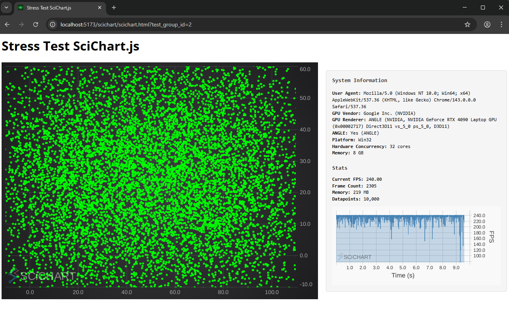

Single chart, single series test with a randomized, Xy data set rendered by scatter points. Starting at 1000 datapoints, the point-count is incrementally updated to 10000, 50000, 100000, 200000, 500000 all the way up to 10 million data-points. 
The dataset is updated in realtime and the chart render speed, memory and frame count is measured. 

This test case stresses the real-time data update rate of the chart for randomised data when rendering scatter plots. As no caching and no optimisations can be enabled for random data, this test stresses the raw drawing performance of the chart.

### Line series unsorted in X

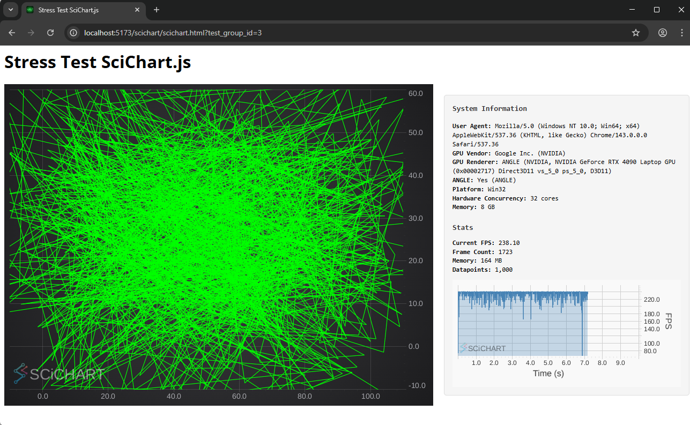

Single chart, single series test with a randomized, Xy data set rendered by line points. Starting at 1000 datapoints, the point-count is incrementally updated to 10000, 50000, 100000, 200000, 500000 all the way up to 10 million data-points.
The dataset is updated in realtime and the chart render speed, memory and frame count is measured.

This test case stresses the real-time data update rate of the chart for randomised data when rendering line plots. As no caching and no optimisations can be enabled for random data, this test stresses the raw drawing performance of the chart.

### Point series, sorted, updating y-values:

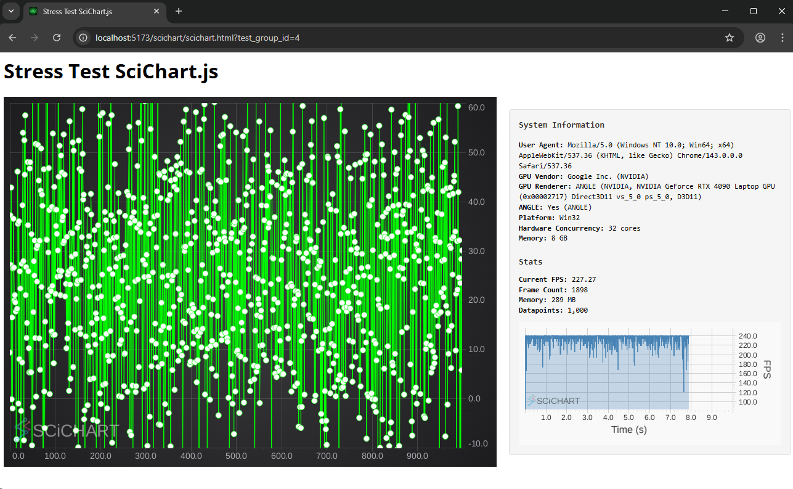

With x-values sorted ascending, some caching optimisations can be enabled, however with randomised data, this test stresses the data update rate of the chart to draw lines and scatter points simultaneously, for incrementally increasing point-counts from 1000 points through to 10 million datapoints.

### Column Chart with data ascending in X:

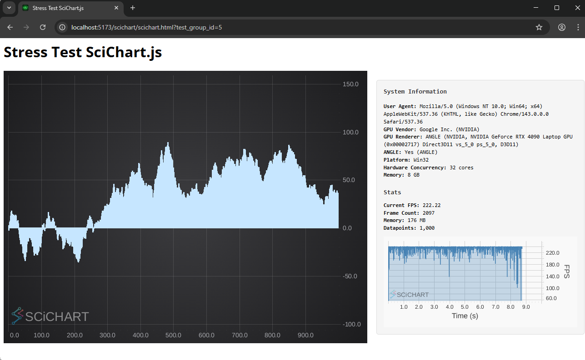

Stresses the rendering performance of column or bar charts, an often overlooked chart type in high performance visualisation, but one that is critical in dashboards and complex applications. 

A static dataset is loaded and the chart programatically zoomed to measure the redraw rate of the chart. This test stresses rendering performance, but not data update rate.

### Candlestick series test:

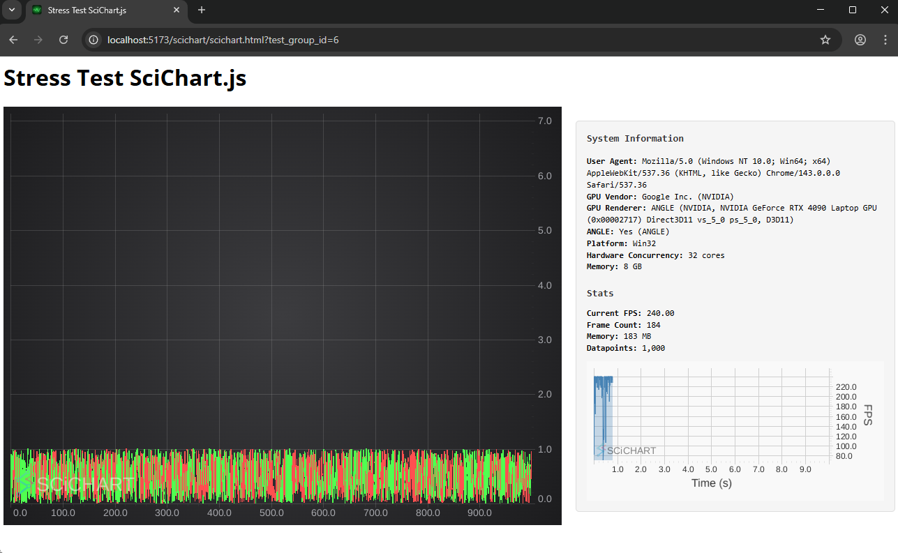

Stresses the rendering performance of candlestick charts, an often overlooked chart type in high performance financial visualisation, but one that is critical in financial applications, quantitative trading and HFT applications.

A static dataset is loaded and the chart programatically zoomed to measure the redraw rate of the chart. This test stresses rendering performance, but not data update rate.

### FIFO / ECG Chart Performance Test:

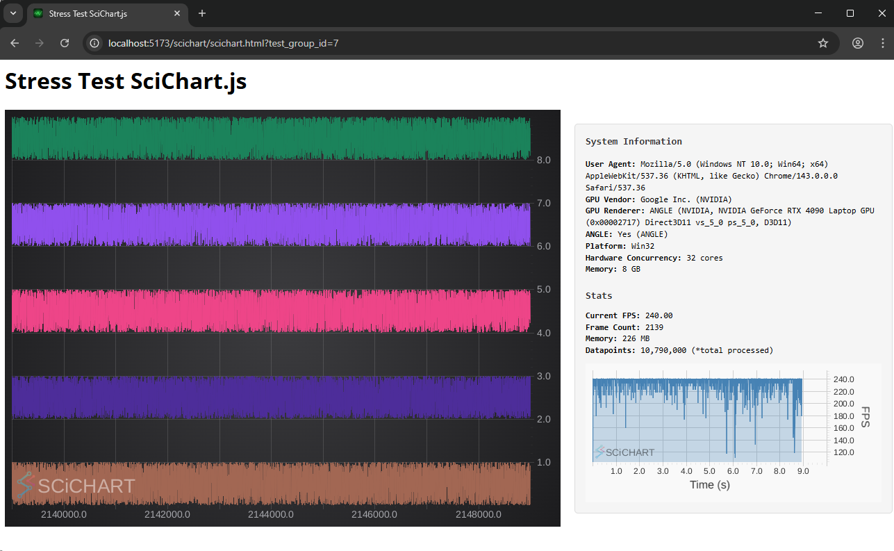

A single chart is loaded with 5 series, each with a fixed number of data-points. New data is appended in realtime and the chart scrolled in a 'First in first out' or ECG style. 
Test cases get incrementally harder starting off at hundreds of data-points per second and ramping up to millions of data-points per second ingested.

This test case stresses the data update rate and rendering capabilities of the charts, giving an indication of the datapoints per second that can realistically be sent to a JavaScript chart under these conditions.

### Mountain Chart Performance Test:

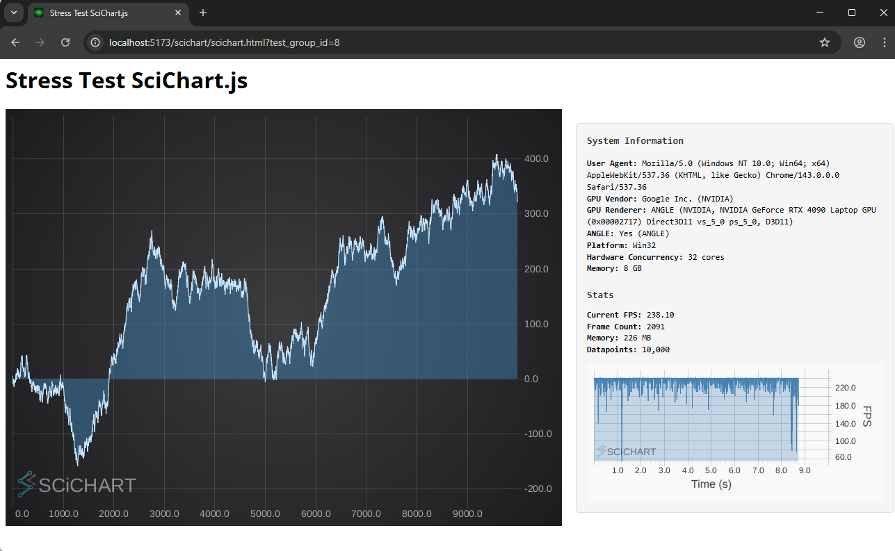

Mountain or area charts with static data where the chart is programmatically zoomed

### Series Compression Test:

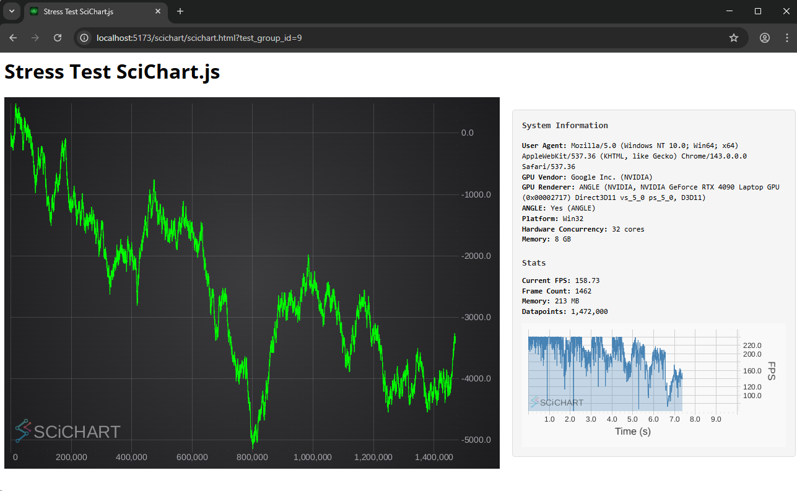

Realtime charts where data is appended to a line chart as fast as you can

### Multi Chart Performance Test:

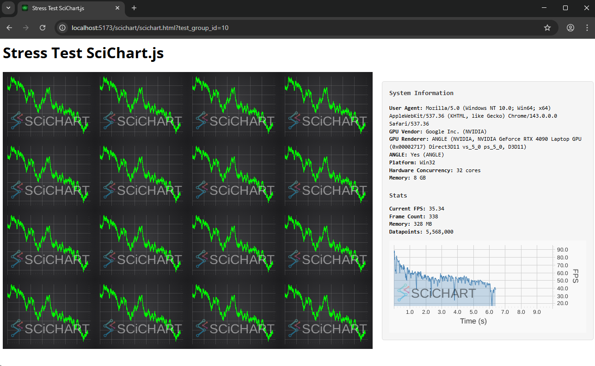

An increasing numbers of charts (2, 4, 8, 16 ... up to 128 charts) each with realtime line series

### Uniform Heatmap Performance Test:

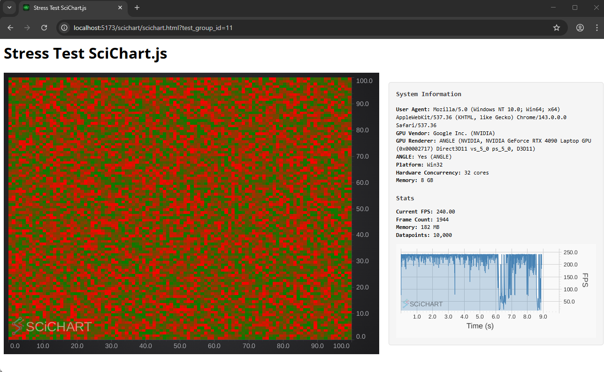

Realtime uniform heatmap updating as fast as possible with increasing number of cells

### 3D Point Cloud Performance Test:

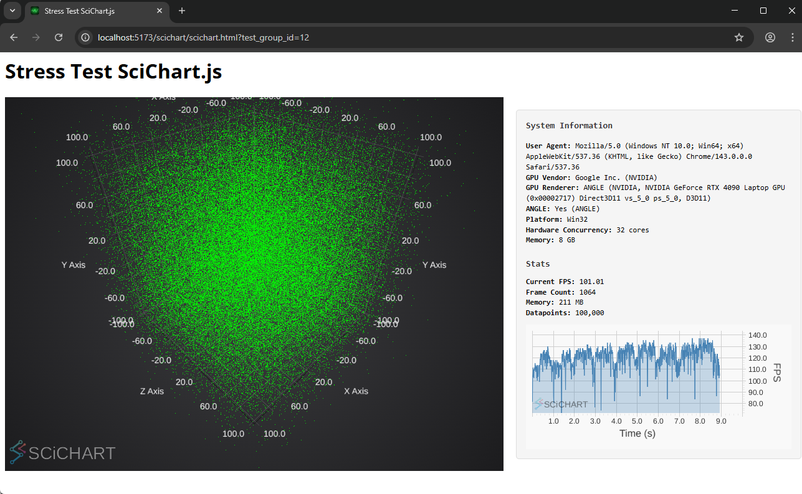

Realtime 3D point clouds with randomised data, with increasing numbers of data-points

### 3D Surface Performance Test:

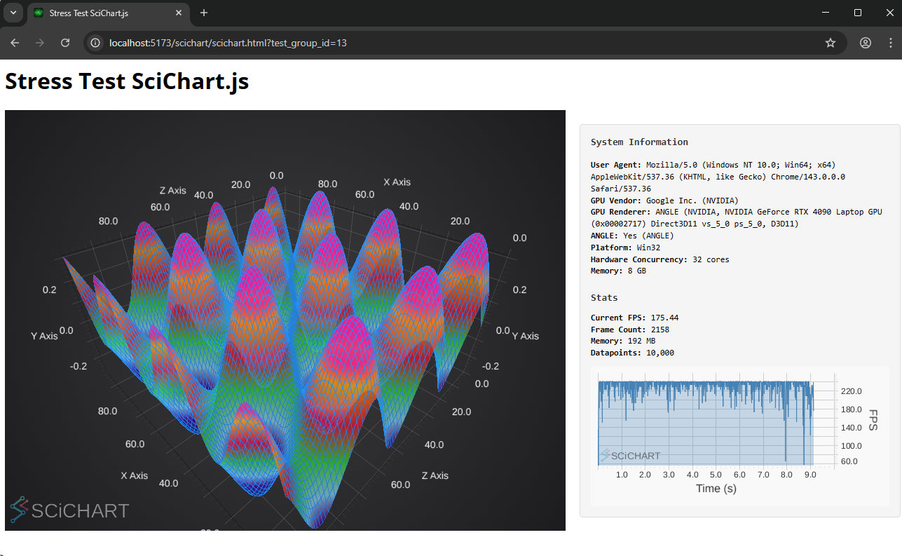

Realtime 3D surface plots with a generated sinusoidal function with increasing number of cells

## Running the Test Suite

Open this folder in terminal and run the following commands:

-   `npm install`
-   `npm start`

Then visit https://localhost:5173 in your web browser.

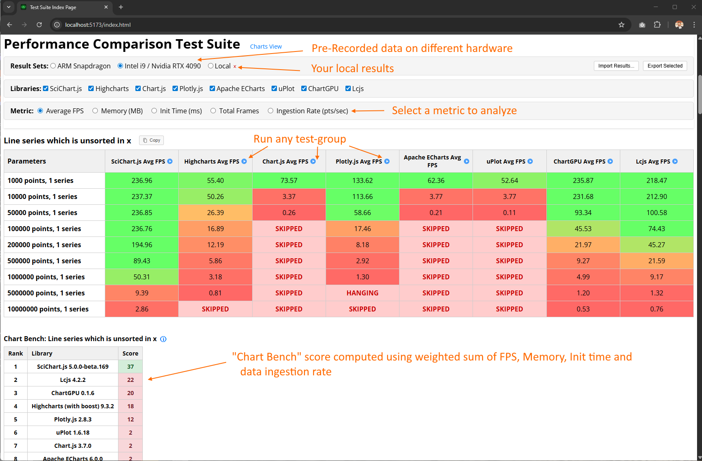

Start any test by clicking "RUN" in the table. It's recommended to only run one test at a time to ensure the CPU usage of each chart stress test does not interfere with another.

### Running an Individual Stress Test 

The stress test page looks like this. Several tests will be run in sequence with ever more demanding requirements (more datapoints, more series, more charts). The test will automatically stop when completed.

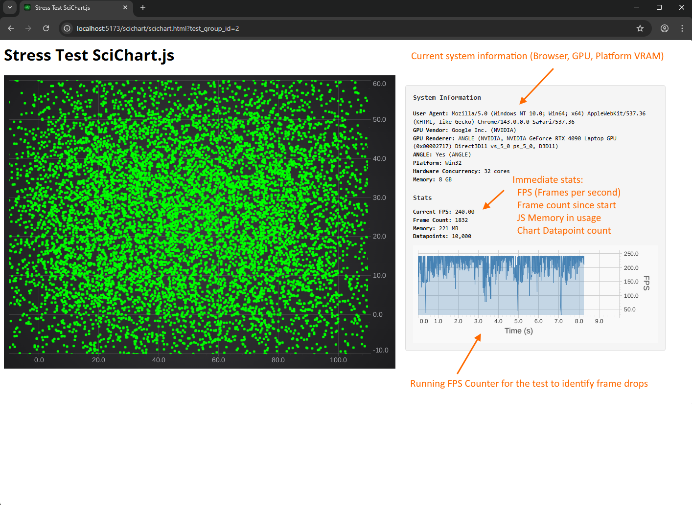

Each test lasts 10 seconds. Each test case may have 5-10 total test runs. Leave the test to run until completion when the results table is shown. 

> **Note:** If any stress-test drops below 2 FPS, hangs, or is errored, subsequent tests will be skipped for that chart library / test case  
>
> The max data-point limit for realtime tests is capped at 100 Million datapoints to fit inside Google Chrome memory limits.

Some stats on the Stress Test page include:

- **System information:** Current browser, GPU, WebGL renderer, Platform, CPU cores, Video RAM
- **Immediate stats:**
  - **Current FPS:** Showing the immediate "Frames per Second" (FPS) or refresh rate in Hertz
  - **Frame count:** the number of frames that have rendered since the start of the test
  - **Memory:** Immediate JavaScript memory (polled using `window.performance.memory?.usedJSHeapSize`). This may not be available on all browsers
  - **Datapoints:** the total datapoint count currently displayed (will include all datapoints for multi-chart tests)

### Viewing Test results

Once a test case has completed, the results will be displayed in a table. This table can be copy-pasted to Excel or downloaded.

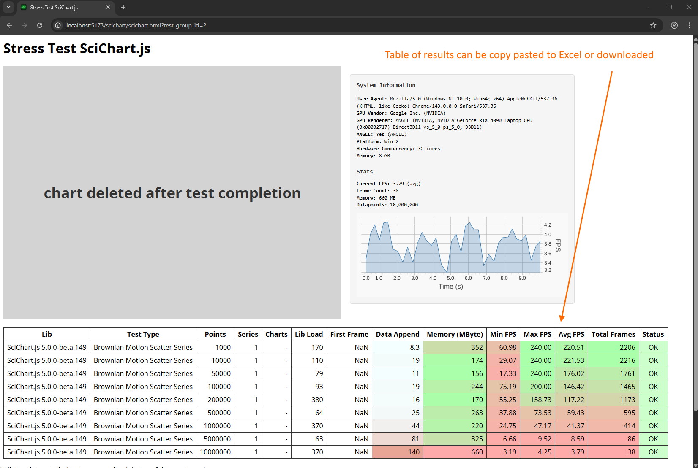

This results table includes:

- The library name and version, e.g. "SciChart.js 5.0.0"
- The test case type e.g. "Brownian Motion Scatter Series"
- The number of datapoints e.g. "10,000"
- The number of series on the chart
- The number of charts (or blank for single-chart cases)
- The time to library load in milliseconds
- The time to first frame in milliseconds
- The time to append data (data update rate)
- The JS memory used as reported by `window.performance.memory?.usedJSHeapSize`
- The Min, Max and Average (mean) FPS
- The total frames rendered in the test
- Any error conditions e.g. 'OK', 'HANGING', 'ERRORED'

## Modifying the Test Suite 

### Adding a new Test Case

1. Create a test type by updating G_TEST_GROUP_NAME in `public/before.js`. For example `CANDLESTICK_PERFORMANCE_TEST`
2. Add test group record to `G_TEST_GROUPS`. For example

```javascript
const G_TEST_GROUPS = {
    ...
    5: {
        name: G_TEST_GROUP_NAME.CANDLESTICK_PERFORMANCE_TEST,
            tests: [
            {
                series: 1,
                points: 1000,
                testDuration: 5000,
            },
            ...
            ]
        }
    }
}
```
3. Create a test function for each test group in the suite. For example `eCandlestickPerformanceTest` in `scichart.js`
4. Update select test if/else statement in `public/after.js`. For example

```javascript
if (testGroupName === G_TEST_GROUP_NAME.CANDLESTICK_PERFORMANCE_TEST) {
    perfTest = eCandlestickPerformanceTest(seriesNumber, pointsNumber);
}
```

4. Update `generateCharts()` function in `public/main.js` file to add new tests to the index page.

### The order of method calls

For any performance test, for example for eLinePerformanceTest, the order of calls is as follows:

1. `createChart` creates a chart
2. `generateData` generates data
3. `appendData` appends data
4. `updateChart` updates the chart
5. `deleteChart` deletes the chart
