# JavaScript Charts Performance Test Suite

## Executive Summary (TL;DR)

This benchmark suite compares the rendering performance of popular JavaScript charting libraries under extreme workloads:

- many series
- different series types (line, scatter, column, mountain, area, candlestick, heatmap, 3D surface, 3D point cloud)
- millions of data-points
- real-time streaming and data ingestion tests
- multiple charts on screen (up to 128 charts)
- heatmaps and 3D charts

### Key Conclusions

- GPU-first architectures scale orders of magnitude further than CPU / Canvas / SVG-based libraries.
- Libraries designed for general-purpose dashboards degrade rapidly under large datasets or high update rates.
- Sustained 60 FPS at large scale is only achievable with WebGL-based rendering and optimized data pipelines.

## What Chart Libraries are tested? 

This Test suite performs JavaScript Chart stress tests and compares the following libraries:

- SciChart.js
- HighCharts (with Boost module)
- Plotly.js (with GL series types where available)
- Chart.js
- Apache eCharts (with GL series types where available)
- uPlot
- ChartGPU
- LightningChart (LCJS)*

> LightningChart.js (LCJS) v4.2.2 was chosen for the test, as this is the latest version which has a community license and does not require a downloadable trial key. The latest version (v8) may achieve different results. 

## Important Methodology Notes & Metrics

The test suite records a number of metrics which are stored in IndexedDB. These can be run as a batch (see Playwright instructions below) and imported, or run one by one via the UI.

- FPS is measured visually and via requestAnimationFrame where applicable.
- Initialisation Time is measured as the time from start of the test to first render (time to first render, milliseconds)
- Memory is recorded via `performance.memory.usedJSHeapSize`. This is only available in the Chromium browsers
- Data ingestion rate is calculated on a per-test basis: e.g. for static tests Data Ingestion Rate = numberOfPoints / timeToFirstRender. For dynamic tests, its numberOfPointsPerFrame * FPS.
- Total frames is output as a metric

Notes: 
- Some libraries may report high rAF rates while rendering visually lags or other large delays on initialisation, e.g. Chart.js.
- Browser crashes, hangs, or skipped tests are considered failures.
- All test results are logged to IndexedDB and displayed on the homepage (refresh page to view)

## What This Benchmark Does NOT Claim

- It does not measure aesthetics, API ergonomics, or learning curve.
- It does not represent typical dashboard workloads.
- It does not imply open source or smaller libraries are "bad" — only that they are not designed for extreme scale.
- Results should not be extrapolated to SVG or static charts (draw once / no interaction use-cases)

## What Test Cases are carried out?

This test suite aims to test a variety of JavaScript Chart operations with a variety of test cases, including Line, Scatter, Column, Candlestick, Heatmap, as well as 3D Chart (Surface mesh/plot, 3D point cloud) and multi-chart cases.

A full list of test cases carried out and their descriptions can be found below:

### N line series M points Test

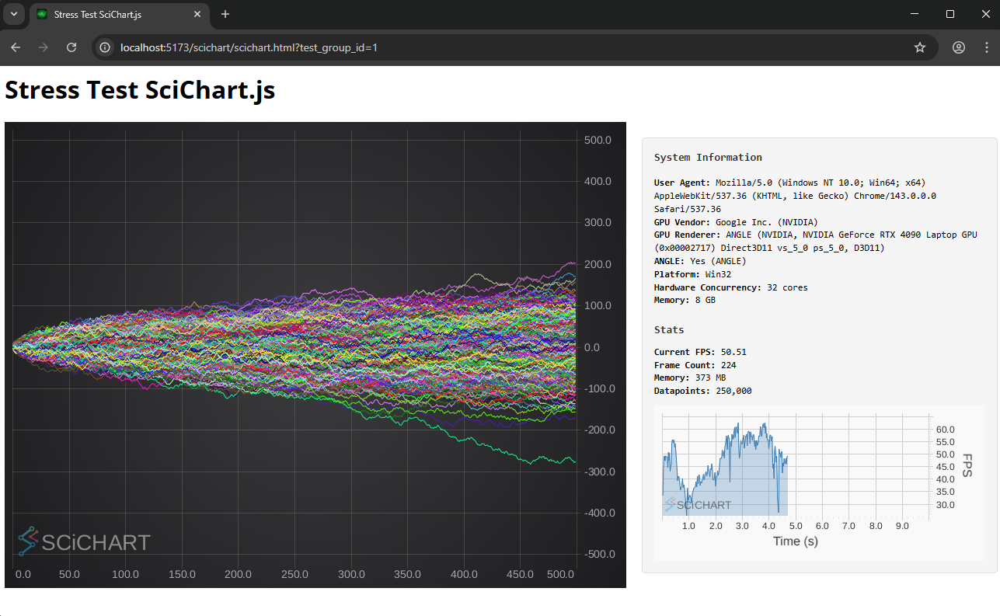

Multi-line test case for monte carlo simulation style charts. Starting with 100 line series x 100 data-points per series,
the test is incrementally updated to 200x200, 500x500, 1000x1000, 2000x2000 and 4000x4000. 

This test case stresses the static overhead of adding a line series and drawing to a chart, while dynamically varying the zoom to measure the update rate.

### Brownian Motion Scatter Series Test

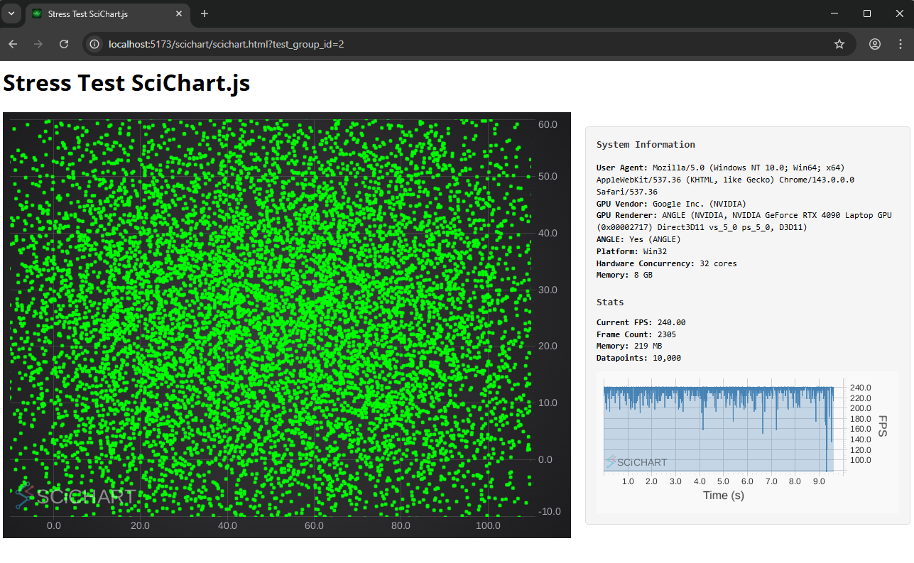

Single chart, single series test with a randomized, Xy data set rendered by scatter points. Starting at 1000 datapoints, the point-count is incrementally updated to 10000, 50000, 100000, 200000, 500000 all the way up to 10 million data-points. 
The dataset is updated in realtime and the chart render speed, memory and frame count is measured. 

This test case stresses the real-time data update rate of the chart for randomised data when rendering scatter plots. As no caching and no optimisations can be enabled for random data, this test stresses the raw drawing performance of the chart.

### Line series unsorted in X

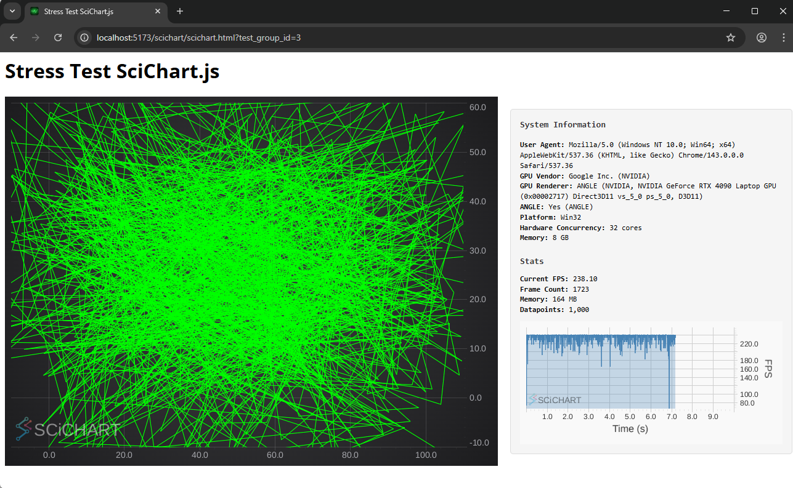

Single chart, single series test with a randomized, Xy data set rendered by line points. Starting at 1000 datapoints, the point-count is incrementally updated to 10000, 50000, 100000, 200000, 500000 all the way up to 10 million data-points.
The dataset is updated in realtime and the chart render speed, memory and frame count is measured.

This test case stresses the real-time data update rate of the chart for randomised data when rendering line plots. As no caching and no optimisations can be enabled for random data, this test stresses the raw drawing performance of the chart.

### Point series, sorted, updating y-values:

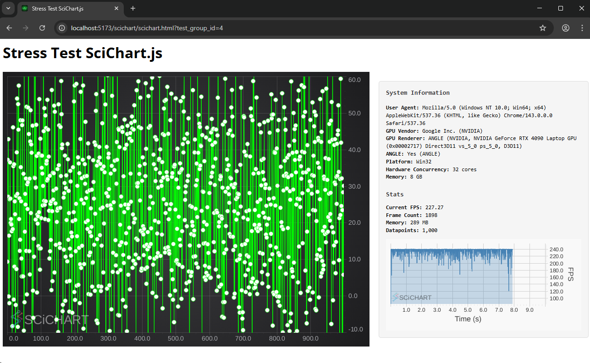

With x-values sorted ascending, some caching optimisations can be enabled, however with randomised data, this test stresses the data update rate of the chart to draw lines and scatter points simultaneously, for incrementally increasing point-counts from 1000 points through to 10 million datapoints.

### Column Chart with data ascending in X:

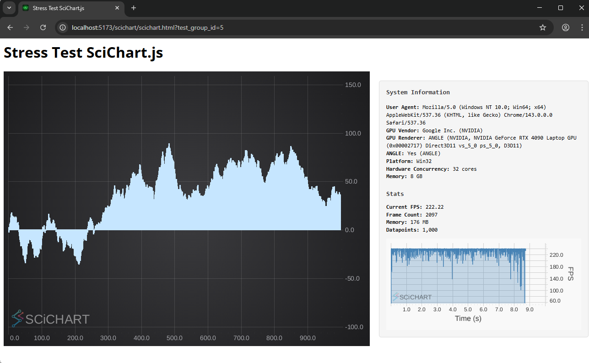

Stresses the rendering performance of column or bar charts, an often overlooked chart type in high performance visualisation, but one that is critical in dashboards and complex applications. 

A static dataset is loaded and the chart programatically zoomed to measure the redraw rate of the chart. This test stresses rendering performance, but not data update rate.

### Candlestick series test:

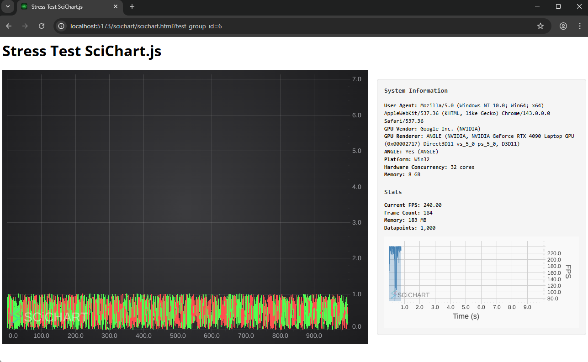

Stresses the rendering performance of candlestick charts, an often overlooked chart type in high performance financial visualisation, but one that is critical in financial applications, quantitative trading and HFT applications.

A static dataset is loaded and the chart programatically zoomed to measure the redraw rate of the chart. This test stresses rendering performance, but not data update rate.

### FIFO / ECG Chart Performance Test:

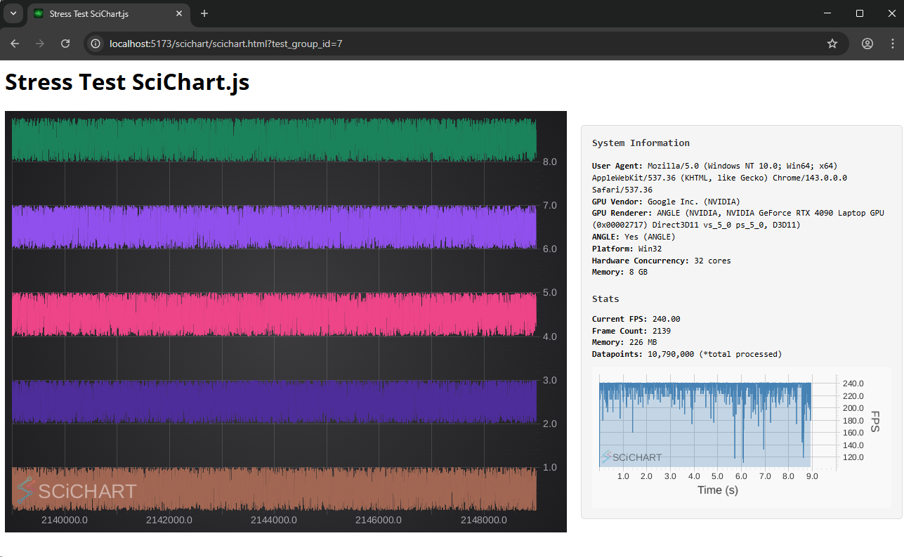

A single chart is loaded with 5 series, each with a fixed number of data-points. New data is appended in realtime and the chart scrolled in a 'First in first out' or ECG style. 
Test cases get incrementally harder starting off at hundreds of data-points per second and ramping up to millions of data-points per second ingested.

This test case stresses the data update rate and rendering capabilities of the charts, giving an indication of the datapoints per second that can realistically be sent to a JavaScript chart under these conditions.

### Mountain Chart Performance Test:

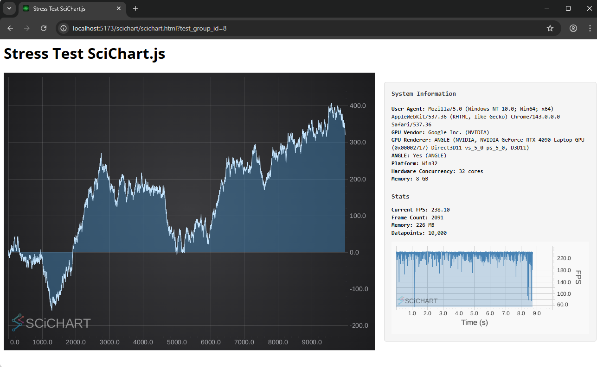

Mountain or area charts with static data where the chart is programmatically zoomed

### Series Compression Test:

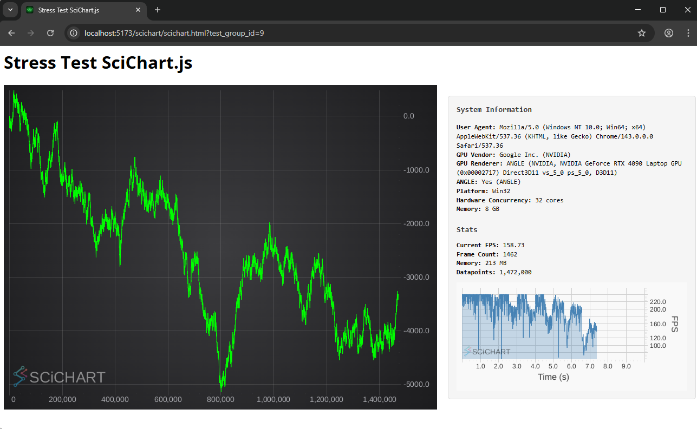

Realtime charts where data is appended to a line chart as fast as you can

### Multi Chart Performance Test:

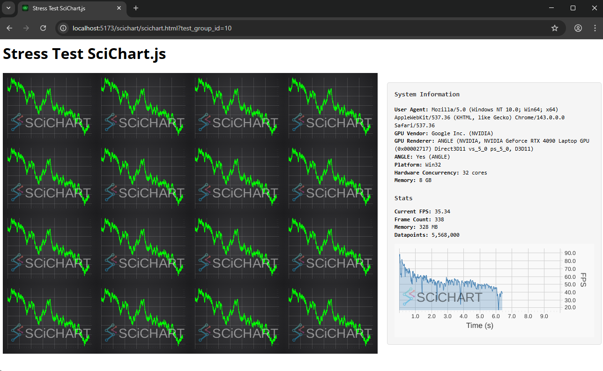

An increasing numbers of charts (2, 4, 8, 16 ... up to 128 charts) each with realtime line series

### Uniform Heatmap Performance Test:

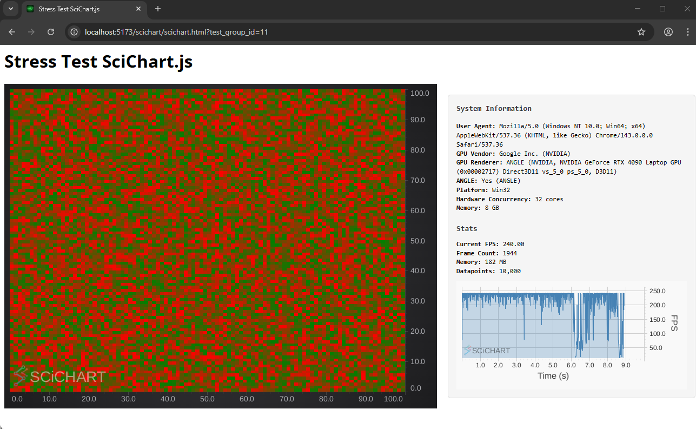

Realtime uniform heatmap updating as fast as possible with increasing number of cells

### 3D Point Cloud Performance Test:

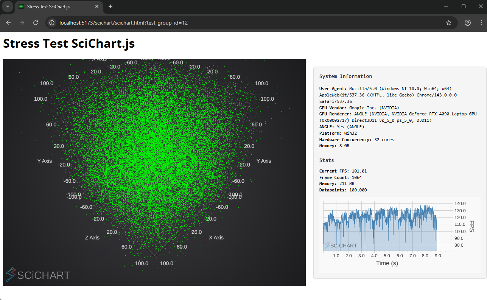

Realtime 3D point clouds with randomised data, with increasing numbers of data-points

### 3D Surface Performance Test:

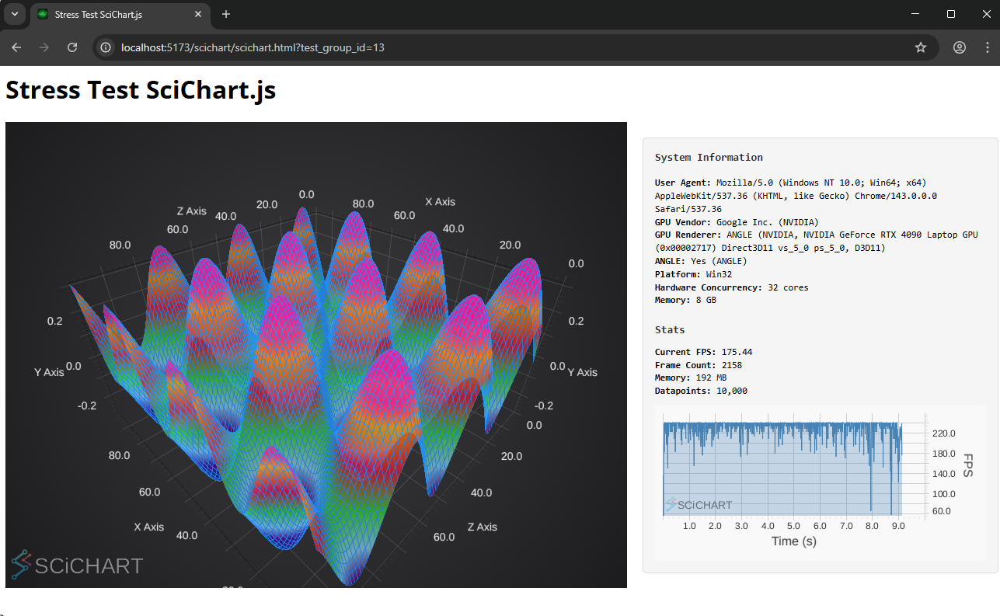

Realtime 3D surface plots with a generated sinusoidal function with increasing number of cells

## Test Results / Performance Comparison of JavaScript Charts

with the following hardware, these test results are achieved:

> **User Agent:** Mozilla/5.0 (Windows NT 10.0; Win64; x64) AppleWebKit/537.36 (KHTML, like Gecko) Chrome/144.0.0.0 Safari/537.36  
> **GPU Vendor:** Google Inc. (NVIDIA)  
> **GPU Renderer:** ANGLE (NVIDIA, NVIDIA GeForce RTX 4090 Laptop GPU (0x00002717) Direct3D11 vs_5_0 ps_5_0, D3D11)  
> **ANGLE:** Yes (ANGLE)  
> **Platform:** Win32  
> **CPU:** Intel Core i9-14900HX (2.2GHz)  
> **Hardware Concurrency:** 32 cores  
> **Video Memory:** 16 GB

### Randomised Scatter Series Performance Test Results

In these tests, uPlot does not support unsorted scatter data, so data must be sorted first. Several charts either hit error states "Hanging" 

In this test, SciChart comes out as the clear winner, able to render 1,000,000 points at ~60 FPS, measuring the fastest in 8/9 test cases and able to render a total of 10,000,000 points. 
In this test case, SciChart was ~3x faster than the closest competitor (LightningChart, LCJS), ~7x faster than ChartGPU, ~12x faster than HighCharts, ~26x faster than Plotly, ~475x faster than chart.js and was able to handle 1000x more data than uPlot and eCharts.

|    FASTEST | Parameters                | SciChart.js (Avg FPS) | Highcharts (Avg FPS) | Chart.js (Avg FPS) | Plotly.js (Avg FPS) | Apache ECharts (Avg FPS) | uPlot (Avg FPS) | Chart GPU (Avg FPS) | LCJS (Avg FPS) |
|-----------:|---------------------------|:---------------------:|:--------------------:|:------------------:|:-------------------:|:------------------------:|:---------------:|:-------------------:|:--------------:|
|   SciChart | 1000 points, 1 series     |        238.08         |        71.75         |       80.78        |       150.39        |          210.21          |     196.68      |       237.84        |     207.09     |
|   ChartGPU | 10000 points, 1 series    |        238.81         |        48.94         |        9.91        |       137.14        |          44.41           |      10.73      |       239.11        |     215.28     |
|   SciChart | 50000 points, 1 series    |        239.04         |        20.00         |        2.08        |        85.39        |         HANGING          |     HANGING     |       199.55        |     170.62     |
|   SciChart | 100000 points, 1 series   |        238.36         |        13.31         |        1.06        |        23.92        |         SKIPPED          |     SKIPPED     |       106.22        |     135.27     |
|   SciChart | 200000 points, 1 series   |        237.52         |        10.54         |        0.50        |        10.54        |         SKIPPED          |     SKIPPED     |        41.09        |     86.24      |
|   SciChart | 500000 points, 1 series   |         98.71         |         6.25         |      SKIPPED       |        5.73         |         SKIPPED          |     SKIPPED     |        15.94        |     43.58      |
|   SciChart | 1000000 points, 1 series  |         59.33         |         3.46         |      SKIPPED       |        2.65         |         SKIPPED          |     SKIPPED     |        6.80         |     22.82      |
|   SciChart | 5000000 points, 1 series  |         10.54         |         0.89         |      SKIPPED       |        0.40         |         SKIPPED          |     SKIPPED     |        1.57         |      4.20      |
|   SciChart | 10000000 points, 1 series |         5.39          |       SKIPPED        |      SKIPPED       |       SKIPPED       |         SKIPPED          |     SKIPPED     |        0.76         |      1.73      |

### Randomlised XY Line Series (unsorted data) performance test results

The randomised Xy Line series test case is similar to the scatter plot test, except that it renders polylines with unsorted Xy data.  

SciChart comes out at the clear winner, with the highest/fastest frame rate in 9 out of 9 tests, able to render 1,000,000 points dynamically updating at 50.31 FPS. In this test case, SciChart was 5x faster than the closest competitor (LightningChart, LCJS)
and 10x faster than ChartGPU, ~16x faster than HighCharts, ~39x faster than Plotly.js, ~915x faster than Chart.js, ~1133x faster than Apache eCharts and ~2163x faster than uPlot. 

|  FASTEST | Parameters                | SciChart.js (Avg FPS) | Highcharts (Avg FPS) | Chart.js (Avg FPS) | Plotly.js (Avg FPS) |  Apache ECharts (Avg FPS)  | uPlot (Avg FPS) | Chart GPU (Avg FPS) | LCJS (Avg FPS) |
|---------:|---------------------------|:---------------------:|:--------------------:|:------------------:|:-------------------:|:--------------------------:|:---------------:|:-------------------:|:--------------:|
| SciChart | 1000 points, 1 series     |        237.79         |        55.40         |       73.57        |       133.62        |           62.36            |      52.64      |       235.87        |     218.47     |
| SciChart | 10000 points, 1 series    |        238.23         |        50.26         |        3.37        |       113.66        |            3.77            |      3.77       |       231.68        |     212.90     |
| SciChart | 50000 points, 1 series    |        237.94         |        26.39         |        0.26        |        58.66        |            0.21            |      0.11       |        93.34        |     100.58     |
| SciChart | 100000 points, 1 series   |        236.58         |        16.89         |      SKIPPED       |        17.46        |          SKIPPED           |     SKIPPED     |        45.53        |     74.43      |
| SciChart | 200000 points, 1 series   |        194.96         |        12.19         |      SKIPPED       |        8.18         |          SKIPPED           |     SKIPPED     |        21.97        |     45.27      |
| SciChart | 500000 points, 1 series   |         89.43         |         5.86         |      SKIPPED       |        2.92         |          SKIPPED           |     SKIPPED     |        9.27         |     21.59      |
| SciChart | 1000000 points, 1 series  |         50.31         |         3.18         |      SKIPPED       |        1.30         |          SKIPPED           |     SKIPPED     |        4.99         |      9.17      |
| SciChart | 5000000 points, 1 series  |         9.39          |         0.81         |      SKIPPED       |       HANGING       |          SKIPPED           |     SKIPPED     |        1.20         |      1.32      |
| SciChart | 10000000 points, 1 series |         2.86          |       SKIPPED        |      SKIPPED       |       SKIPPED       |          SKIPPED           |     SKIPPED     |        0.53         |      0.76      |

### Column series static data test results

In Static Column charts, SciChart excels, able to draw 10,000,000 columns or bars at ~240 FPS. The reason is the data here is not updating, this just measures static drawing of a large dataset.

In this test case, SciChart was the clear winner scoring 'Fastest' in 9 out of 9 test cases, with all test scores ~240 FPS and able to render: ~35x faster than LightningChart (LCJS) at 10k points, and handling up to 1000x more data than LCJS,
~298x faster than HighCharts, ~137x faster than Chart.js, ~771x faster than Plotly.js, ~7x faster than Apache eCharts and handling 100x more data than eCharts, ~291x faster than uPlot and ~239x faster than ChartGPU.

|       FASTEST | Parameters                | SciChart.js (Avg FPS) | Highcharts (Avg FPS) | Chart.js (Avg FPS) | Plotly.js (Avg FPS) | Apache ECharts (Avg FPS) | uPlot (Avg FPS) | Chart GPU (Avg FPS) | LCJS (Avg FPS)  |
|--------------:|---------------------------|:---------------------:|:--------------------:|:------------------:|:-------------------:|:------------------------:|:---------------:|:-------------------:|:---------------:|
|      SciChart | 1000 points, 1 series     |        237.03         |        57.52         |       127.22       |        83.97        |          20.79           |     231.03      |       235.13        |      61.69      |
|      SciChart | 10000 points, 1 series    |        238.34         |        60.97         |       19.80        |        9.15         |          95.29           |     166.52      |       218.53        |      6.77       |
|      SciChart | 50000 points, 1 series    |        239.09         |        21.56         |        3.80        |        1.09         |          91.42           |      32.96      |       184.87        |     HANGING     |
|      SciChart | 100000 points, 1 series   |        239.14         |        13.77         |        1.75        |        0.31         |          34.12           |      15.52      |       115.12        |     SKIPPED     |
|      SciChart | 200000 points, 1 series   |        239.36         |         9.97         |      SKIPPED       |       SKIPPED       |    ERROR_APPEND_DATA     |      6.57       |        70.48        |     SKIPPED     |
|      SciChart | 500000 points, 1 series   |        239.44         |         6.10         |      SKIPPED       |       SKIPPED       |         SKIPPED          |      2.17       |        35.19        |     SKIPPED     |
|      SciChart | 1000000 points, 1 series  |        238.79         |         3.00         |      SKIPPED       |       SKIPPED       |         SKIPPED          |      0.82       |        17.26        |     SKIPPED     |
|      SciChart | 5000000 points, 1 series  |        238.23         |         0.80         |      SKIPPED       |       SKIPPED       |         SKIPPED          |     SKIPPED     |        2.12         |     SKIPPED     |
|      SciChart | 10000000 points, 1 series |        237.03         |       SKIPPED        |      SKIPPED       |       SKIPPED       |         SKIPPED          |     SKIPPED     |        0.99         |     SKIPPED     |

### Candlestick chart static data test results

In static candlestick charts, SciChart excels, able to draw 10,000,000 candles at ~230 FPS. Candlesticks are complex geometry including a box with an outline, and high/low wick. As a result several chart libraries fail to handle large volumes of candles at reasonable levels of performance.

In this test case, SciChart was the clear winner scoring 'Fastest' in 7/9 test cases, with all test-scores way over 200 FPS and able to handle: 10,000x more data than LightningChart (LCJS), 
and scored ~393x faster than HighCharts, ~258x faster than Chart.js, ~108x faster than Plotly with 1000x more data capacity, ~63x faster than Apache eCharts, ~263x faster than uPlot, and ~42x faster than ChartGPU.

Another artefact noted in this test: Chart.js performance results show `requestAnimationFrame` able to tick at 49.78 FPS for 1,000 candles (but dropping to ~1 FPS for 50,000) but in actual fact, the viewable refresh rate seemed to be much lower. We suspect the visual refresh rate may be decoupled from browser refreshes.

|       FASTEST | Parameters                | SciChart.js (Avg FPS) | Highcharts (Avg FPS) | Chart.js (Avg FPS) | Plotly.js (Avg FPS) | Apache ECharts (Avg FPS) | uPlot (Avg FPS) | Chart GPU (Avg FPS) | LCJS (Avg FPS) |
|--------------:|---------------------------|:---------------------:|:--------------------:|:------------------:|:-------------------:|:------------------------:|:---------------:|:-------------------:|:--------------:|
|      ChartGPU | 1000 points, 1 series     |        236.08         |        18.76         |       49.78        |        26.15        |          230.10          |     230.22      |       236.27        |     38.96      |
|      ChartGPU | 10000 points, 1 series    |        236.18         |         0.60         |        7.89        |        2.17         |          139.48          |      59.85      |       238.14        |    HANGING     |
|      SciChart | 50000 points, 1 series    |        234.73         |       HANGING        |        0.91        |       HANGING       |          46.46           |      13.90      |       232.73        |    SKIPPED     |
|      SciChart | 100000 points, 1 series   |        234.84         |       SKIPPED        |      SKIPPED       |       SKIPPED       |          28.32           |      6.63       |       189.85        |    SKIPPED     |
|      SciChart | 200000 points, 1 series   |        233.60         |       SKIPPED        |      SKIPPED       |       SKIPPED       |          15.97           |      2.86       |       139.19        |    SKIPPED     |
|      SciChart | 500000 points, 1 series   |        234.46         |       SKIPPED        |      SKIPPED       |       SKIPPED       |           7.65           |      0.89       |        77.61        |    SKIPPED     |
|      SciChart | 1000000 points, 1 series  |        234.66         |       SKIPPED        |      SKIPPED       |       SKIPPED       |           3.75           |     SKIPPED     |        47.02        |    SKIPPED     |
|      SciChart | 5000000 points, 1 series  |        232.69         |       SKIPPED        |      SKIPPED       |       SKIPPED       |         HANGING          |     SKIPPED     |        10.89        |    SKIPPED     |
|      SciChart | 10000000 points, 1 series |        228.04         |       SKIPPED        |      SKIPPED       |       SKIPPED       |         SKIPPED          |     SKIPPED     |        5.49         |    SKIPPED     |

### FIFO / ECG Streaming Line Chart Performance Test Results

For a highly dynamic dataset, with 5 line series each with 'first in first out' streaming, the type of chart used in real-time telemetry monitoring or ECG monitoring, the libraries performed as follows.

SciChart was the clear winner, scoring 'fastest' in 5 out of 6 test cases, able to render 5x series streaming with 1,000,000 points each at ~76 FPS, and a total data update rate of over 39,480,000 data-points per second ingested. 
The most demanding scenario tested was 10,000,000 datapoints x 5 series which SciChart could handle at 18.13 FPS.

Compared with competitors, SciChart benched at ~60x faster than HighCharts, ~124x faster than Plotly.js, ~145x faster than Apache eCharts, ~14.5x faster than uPlot. ~11.4x faster than ChartGPU and ~3.3x faster than LightningChart (LCJS), 

In this test, SciChart was the only chart library able to handle the most demanding test case (10,000,000 datapoints per series, x5 series, updating at ~40M datapoints per second) at a reasonably interactive framerate. 

|  FASTEST | Parameters                | SciChart.js (Avg FPS) | Highcharts (Avg FPS) | Chart.js (Avg FPS) | Plotly.js (Avg FPS) | Apache ECharts (Avg FPS) | uPlot (Avg FPS) | Chart GPU (Avg FPS) | LCJS (Avg FPS) |
|---------:|---------------------------|:---------------------:|:--------------------:|:------------------:|:-------------------:|:------------------------:|:---------------:|:-------------------:|:--------------:|
| ChartGPU | 100 points, 5 series      |        236.05         |        67.17         |       102.14       |       106.29        |          212.86          |     230.72      |       237.66        |     171.18     |
| SciChart | 10000 points, 5 series    |        236.44         |        18.82         |       17.35        |        62.77        |          17.08           |     184.10      |       230.87        |     219.43     |
| SciChart | 100000 points, 5 series   |        235.56         |         3.92         |      HANGING       |        5.75         |           1.62           |      97.92      |        58.92        |     135.08     |
| SciChart | 1000000 points, 5 series  |         75.63         |       HANGING        |      SKIPPED       |        0.61         |         HANGING          |      12.15      |        6.64         |     29.13      |
| SciChart | 5000000 points, 5 series  |         28.61         |       SKIPPED        |      SKIPPED       |       SKIPPED       |         SKIPPED          |      2.56       |       ERRORED       |      8.75      |
| SciChart | 10000000 points, 5 series |         18.13         |       SKIPPED        |      SKIPPED       |       SKIPPED       |         SKIPPED          |      1.25       |       SKIPPED       |    HANGING     |

### Multi chart performance test results

Single chart, single series tests reveal raw throughput of charts, but can chart libraries scale with number of charts on screen? In this test, we increased the difficulty by having up to 128 charts on screen, showing a mixture of realtime & static data in line series, column, mountain and scatter, each with 100k data-point count.

In this test case, SciChart scored 'fastest' in 7 out of 8 tests. In the multi-chart test, SciChart benched ~61 faster than HighCharts,
~202x faster than Plotly, ~166x faster than Chart.js, ~32x faster than Apache eCharts (and 128x more charts on screen), 6x faster than ChartGPU (and 4x more charts on screen), 2x faster than uPlot (and 128x more charts on screen).

Both eCharts and uPlot failed beyond 1x chart in this demanding test, LightningChart (LCJS) and Chart.js failed at 4x charts, HighCharts and ChartGPU failed beyond 32 charts. In this test case, SciChart was the only chart library able to render
128 charts with realtime dynamic data.

|  FASTEST | Parameters                          | SciChart.js (Avg FPS) | Highcharts (Avg FPS) | Chart.js (Avg FPS) | Plotly.js (Avg FPS) | Apache ECharts (Avg FPS) | uPlot (Avg FPS) | Chart GPU (Avg FPS) | LCJS (Avg FPS) |
|---------:|-------------------------------------|:---------------------:|:--------------------:|:------------------:|:-------------------:|:------------------------:|:---------------:|:-------------------:|:--------------:|
|     LCJS | 100000 points, 1 series, 1 charts   |        154.64         |        13.53         |        1.84        |        11.04        |           4.85           |      79.31      |        65.65        |     205.84     |
| SciChart | 100000 points, 1 series, 2 charts   |        127.81         |         7.57         |        0.77        |        8.41         |         HANGING          |     HANGING     |        51.15        |     95.80      |
| SciChart | 100000 points, 1 series, 4 charts   |        108.93         |         3.30         |      SKIPPED       |        0.54         |         SKIPPED          |     SKIPPED     |        33.16        |    HANGING     |
| SciChart | 100000 points, 1 series, 8 charts   |         77.21         |         1.74         |      SKIPPED       |       SKIPPED       |         SKIPPED          |     SKIPPED     |        18.31        |    SKIPPED     |
| SciChart | 100000 points, 1 series, 16 charts  |         49.22         |         1.08         |      SKIPPED       |       SKIPPED       |         SKIPPED          |     SKIPPED     |        7.95         |    SKIPPED     |
| SciChart | 100000 points, 1 series, 32 charts  |         29.26         |         0.48         |      SKIPPED       |       SKIPPED       |         SKIPPED          |     SKIPPED     |        4.70         |    SKIPPED     |
| SciChart | 100000 points, 1 series, 64 charts  |         15.78         |       SKIPPED        |      SKIPPED       |       SKIPPED       |         SKIPPED          |     SKIPPED     |       SKIPPED       |    SKIPPED     |
| SciChart | 100000 points, 1 series, 128 charts |         7.58          |       SKIPPED        |      SKIPPED       |       SKIPPED       |         SKIPPED          |     SKIPPED     |       SKIPPED       |    SKIPPED     |

### Thousands of Line Series, Thousands of points

In this test, Plotly.js and LCJS have higher FPS in mid-range point counts, but both hang at higher point/series counts. Hanging means the chart hangs (more than 3 seconds = `testDuration` to initialise).
Skipped means subsequent tests are skipped due to either low FPS or error conditions.

In this test case, SciChart was the only chart library able to render 4000 series x 4000 points, and 8000 series x 8000 points with an initialisation time sub 3-seconds, able to handle 16x more data than the closest competitor (LightningChart, LCJS).

|   FASTEST | Parameters               | SciChart.js (Avg FPS) | Highcharts (Avg FPS) | Chart.js (Avg FPS) | Plotly.js (Avg FPS) | Apache ECharts (Avg FPS) | uPlot (Avg FPS) | Chart GPU (Avg FPS)  | LCJS (Avg FPS)  |
|----------:|--------------------------|:---------------------:|:--------------------:|:------------------:|:-------------------:|:------------------------:|:---------------:|:--------------------:|:---------------:|
|  SciChart | 100 points, 100 series   |         237.45        |        41.39         |        9.61        |       225.46        |          92.96           |     183.49      |        212.93        |     219.33      |
|    Plotly | 200 points, 200 series   |         235.88        |       HANGING        |        2.64        |       238.77        |          40.61           |      43.16      |        120.22        |     226.57      |
|      LCJS | 500 points, 500 series   |         117.79        |       SKIPPED        |        0.43        |       148.25        |           9.12           |      6.10       |        43.36         |     180.12      |
|    Plotly | 1000 points, 1000 series |         60.86         |       SKIPPED        |       SKIPPED      |        94.28        |           2.51           |      1.52       |        18.17         |      90.22      |
|      LCJS | 2000 points, 2000 series |         27.54         |       SKIPPED        |       SKIPPED      |        49.14        |         HANGING          |      0.29       |         5.77         |      37.44      |
|  SciChart | 4000 points, 4000 series |          9.97         |       SKIPPED        |       SKIPPED      |       HANGING       |         SKIPPED          |     HANGING     |       HANGING        |     HANGING     |
|  SciChart | 8000 points, 8000 series |          2.76         |       SKIPPED        |       SKIPPED      |       SKIPPED       |         SKIPPED          |     SKIPPED     |       SKIPPED        |     SKIPPED     |

### Uniform Heatmap Chart Performance test results

In this test, a 2D uniform heatmap with a color map is updated with real-time data. SciChart excelled being able to render a 1000x1000 heatmap at ~40 FPS and scored 'fastest' in 5 out of 7 test cases.

Note: Chart.js does not support a heatmap and uPlot, we couldn't get this to work.

|  FASTEST | Parameters             | SciChart.js (Avg FPS) | Highcharts (Avg FPS) | Chart.js (Avg FPS) | Plotly.js (Avg FPS) | Apache ECharts (Avg FPS) | uPlot (Avg FPS) | Chart GPU (Avg FPS) | LCJS (Avg FPS) |
|---------:|------------------------|:---------------------:|:--------------------:|:------------------:|:-------------------:|:------------------------:|:---------------:|:-------------------:|:--------------:|
| SciChart | 100 points, 1 series   |        235.67         |        16.39         |    Unsupported     |       122.39        |          19.24           |   Unsupported   |     Unsupported     |     227.20     |
| SciChart | 200 points, 1 series   |        235.76         |         4.85         |         -          |        72.34        |           5.18           |        -        |          -          |     229.61     |
| SciChart | 500 points, 1 series   |        143.55         |         0.82         |         -          |        17.40        |           0.67           |        -        |          -          |     84.44      |
| SciChart | 1000 points, 1 series  |         39.97         |       SKIPPED        |         -          |        4.75         |         SKIPPED          |        -        |          -          |     25.39      |
| SciChart | 2000 points, 1 series  |         9.48          |       SKIPPED        |         -          |        1.16         |         SKIPPED          |        -        |          -          |      6.24      |
|     LCJS | 4000 points, 1 series  |         2.32          |       SKIPPED        |         -          |       SKIPPED       |         SKIPPED          |        -        |          -          |      3.09      |
|     LCJS | 8000 points, 1 series  |         0.48          |       SKIPPED        |         -          |       SKIPPED       |         SKIPPED          |        -        |          -          |      0.67      |
|        - | 16000 points, 1 series |        SKIPPED        |       SKIPPED        |         -          |       SKIPPED       |         SKIPPED          |        -        |          -          |    SKIPPED     |

### 3D Point Cloud Chart Performance Test Results

3D Charts are also tested, only Plotly.js, Apache eCharts, LightningChart (LCJS) and SciChart.js support 3D point clouds, so HighCharts, Chart.js, ChartGPU and uPlot were excluded from these tests.

For rendering 3D point clouds, SciChart.js excels, able to render 100,000 point point-clouds at 140 FPS, or 1,000,000 point point-clouds at 15.89 FPS in a fully dynamic dataset (data replaced completely each frame).

SciChart scored "fastest" in 6 out of 7 tests, beaten only by Apache eCharts at 1000 points, where eCharts scored 240 FPS vs. SciChart 231 FPS (negligable). SciChart was the fastest chart library on the hardest test condition (4 million Xyz datapoints)
scoring 3.58 FPS, a data ingestion rate of 14 million Xyz datapoints per second. 

|  FASTEST | Parameters               | SciChart.js (Avg FPS) | Highcharts (Avg FPS)  | Chart.js (Avg FPS)  | Plotly.js (Avg FPS) | Apache ECharts (Avg FPS) | uPlot (Avg FPS)  | Chart GPU (Avg FPS) | LCJS (Avg FPS) |
|---------:|--------------------------|:---------------------:|:---------------------:|:-------------------:|:-------------------:|:------------------------:|:----------------:|:-------------------:|:--------------:|
| SciChart | 100 points, 1 series     |        227.89         |      Unsupported      |     Unsupported     |        83.98        |          229.36          |   Unsupported    |     Unsupported     |     226.28     |
|  eCharts | 1000 points, 1 series    |        231.49         |           -           |          -          |        51.24        |          239.69          |        -         |          -          |     235.65     |
| SciChart | 10000 points, 1 series   |        231.15         |           -           |          -          |        12.59        |          82.37           |        -         |          -          |     226.90     |
| SciChart | 100000 points, 1 series  |        140.83         |           -           |          -          |        1.41         |           8.60           |        -         |          -          |     78.83      |
| SciChart | 1000000 points, 1 series |         15.89         |           -           |          -          |  ERROR_APPEND_DATA  |           1.25           |        -         |          -          |      7.39      |
| SciChart | 2000000 points, 1 series |         7.65          |           -           |          -          |       SKIPPED       |           0.67           |        -         |          -          |      3.40      |
| SciChart | 4000000 points, 1 series |         3.58          |           -           |          -          |       SKIPPED       |         SKIPPED          |        -         |          -          |      1.87      |

### 3D Surface Mesh Performance Test Results

For 3D surface meshes, SciChart.js excels, being able to render a 500x500 mesh at 95.62 FPS and 1000x1000 mesh at 27.69 FPS. Plotly.js was able to render 500x500 at 5.07 FPS and 1000x1000 at 1.34 FPS. 
eCharts was able to render 500x500 at 2.40 FPS and 1000x1000 at 0.48 FPS. ChartGPU, uPlot, HighCharts and uPlot were all disabled for this test as 3D surface meshes were unsupported.

In this test, LightningChart (LCJS) scored fastest in 6 out of 7 tests, with a very close second by SciChart.js. It is important to note that SciChart FPS scores were often within 2% - 10% of LCJS with only larger differences seen beyond 4000x4000 surface meshes.

|  FASTEST | Parameters            | SciChart.js (Avg FPS) | Highcharts (Avg FPS) | Chart.js (Avg FPS) | Plotly.js (Avg FPS) | Apache ECharts (Avg FPS) | uPlot (Avg FPS) | Chart GPU (Avg FPS) | LCJS (Avg FPS) |
|---------:|-----------------------|:---------------------:|:--------------------:|:------------------:|:-------------------:|:------------------------:|:---------------:|:-------------------:|:--------------:|
| SciChart | 100 points, 1 series  |        229.21         |     Unsupported      |     Unsupported    |        26.71        |          40.95           |   Unsupported   |     Unsupported     |     226.72     |
|     LCJS | 200 points, 1 series  |        231.35         |          -           |         -          |        24.41        |          15.02           |        -        |          -          |     236.31     |
|     LCJS | 500 points, 1 series  |         95.62         |          -           |         -          |        5.07         |           2.40           |        -        |          -          |     99.31      |
|     LCJS | 1000 points, 1 series |         27.69         |          -           |         -          |        1.34         |           0.48           |        -        |          -          |     30.47      |
|     LCJS | 2000 points, 1 series |         5.96          |          -           |         -          |       HANGING       |         SKIPPED          |        -        |          -          |      6.73      |
|     LCJS | 4000 points, 1 series |         1.28          |          -           |         -          |       SKIPPED       |         SKIPPED          |        -        |          -          |      2.64      |
|     LCJS | 8000 points, 1 series |        SKIPPED        |          -           |         -          |       SKIPPED       |         SKIPPED          |        -        |          -          |      0.63      |

### Test Result Conclusions

## Aggregation of test scores

Based on FPS alone, SciChart.js scored "Fastest" in 60 out of 79 performance tests (scoring fastest in 83% of tests), covering a wide range of 2D & 3D chart types, multi-chart cases, static charts and realtime charts, against a wide variety of competitors including HighCharts, Chart.js, Plotly.js, Apache eCharts, uPlot, ChartGPU and LightingChart (LCJS).

By running the test application, you can also view data such as data-ingestion rate, memory usage and initialisation time, areas which SciChart.js is also highly optimised for, scoring as high as 40+ million datapoints per second in real-time tests for data ingestion, and with chart initialisation times which typically score lower than all competing chart libraries. 

## Suitability by Use Case

| Use Case                                     | Suitable Libraries                           | Notes                                              |
|----------------------------------------------|----------------------------------------------|----------------------------------------------------|
| Small dashboards (<10k points)               | Chart.js, Highcharts, ECharts, Plotly, uPlot | All perform adequately                             |
| Large datasets (≥100k - 1M points)           | SciChart                                     | Several others degrade or fail                     |
| Real-time streaming (ECG/FIFO)               | SciChart                                     | Sustained FPS under load, high data-ingestion rate |
| Many series (1000+)                          | SciChart                                     | CPU-based libraries stall                          |
| Heatmaps (1M+ cells)                         | SciChart                                     | Several others skipped or unsupported              |
| 3D charts                                    | SciChart                                     | Sevearl others crash or skip                       |
| Combined dashboards with several chart types | SciChart                                     | All others have cumulative performance problems    |

## Final Conclusion

JavaScript charting performance is fundamentally architecture-bound.
CPU-based and general-purpose charting libraries cannot scale to large, real-time, or multi-surface workloads.
Only GPU-accelerated, purpose-built charting engines remain usable at extreme scale.

Optimising a library for a variety of purposes is a difficult job, while one library may excel in one test-case, SciChart excels in all. Combined with a highly flexible API, large number (70+) of chart types and backed by excellent documentation, we present SciChart as the best choice for JavaScript Charting under extreme workloads or mission critical datavisualisation applications.

## Running the Test Suite

Open this folder in terminal and run the following commands:

-   `npm install`
-   `npm start`

Then visit https://localhost:5173 in your web browser.

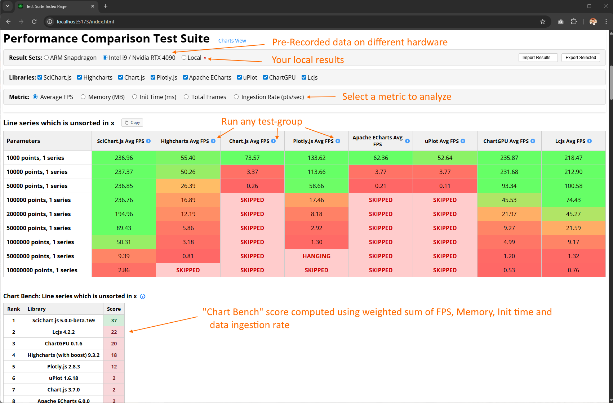

### Viewing pre-recorded results

We've included a number of pre-canned results from different hardware (Intel i9 / nVidia 4090, ARM Snapdragon) that you can view. Select these under the **Result Sets** section.

You can toggle between which metric to analyze on the homepage: FPS (Frames per second), Memory usage (MB), Initialisation Time (milliseconds), Total Frames, Data Ingestion rate (points per second)


### Running an Individual Stress Test

You can run your own tests by clicking ">" in the table header on the homepage. Each test will open a new tab and run until completion.

> **It's recommended to only run one test at a time to ensure the CPU usage of each chart stress test does not interfere with another.**
>
> **Close the tab after test completion. The homepage will automatically update with the test results.**

The stress test page looks like this. Several tests will be run in sequence with ever more demanding requirements (more datapoints, more series, more charts). The test will automatically stop when completed.

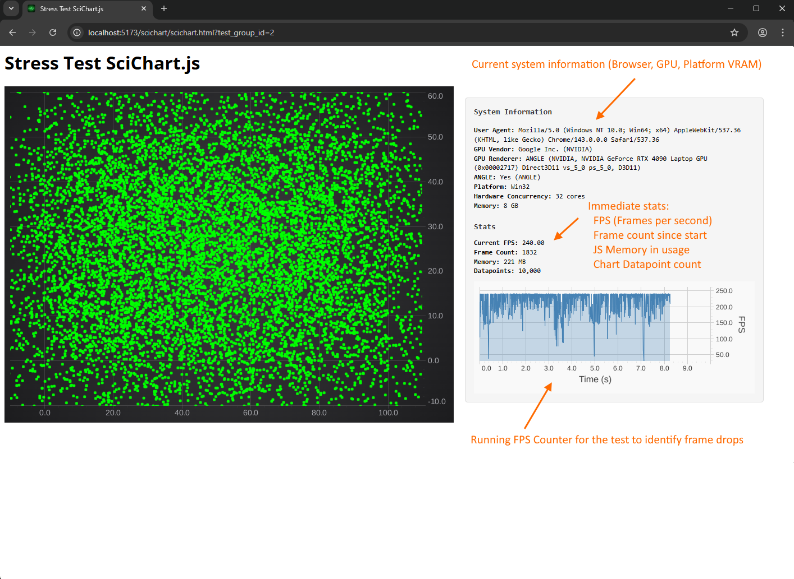

Each test lasts 3 seconds. Each test case may have 5-10 total test runs. Leave the test to run until completion when the results table is shown.

> **Note:** If any stress-test drops below 2 FPS, hangs, or is errored, subsequent tests will be skipped for that chart library / test case
>
> The max data-point limit for realtime tests is capped at 100 Million datapoints to fit inside Google Chrome memory limits.

Some stats on the Stress Test page include:

- **System information:** Current browser, GPU, WebGL renderer, Platform, CPU cores, Video RAM
- **Immediate stats:**
  - **Current FPS:** Showing the immediate "Frames per Second" (FPS) or refresh rate in Hertz
  - **Frame count:** the number of frames that have rendered since the start of the test
  - **Memory:** Immediate JavaScript memory (polled using `window.performance.memory?.usedJSHeapSize`). This may not be available on all browsers
  - **Datapoints:** the total datapoint count currently displayed (will include all datapoints for multi-chart tests)

### Viewing Test results

Once a test case has completed, the results will be persisted to IndexedDB and displayed in a table. 

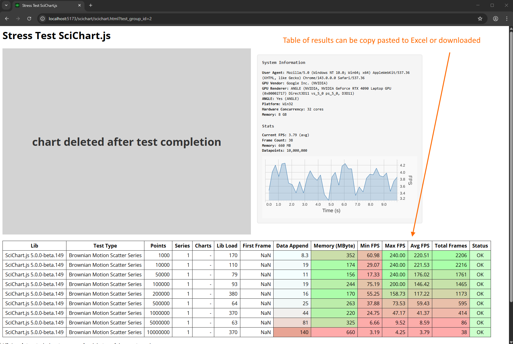

This results table includes:

- The library name and version, e.g. "SciChart.js 5.0.0"
- The test case type e.g. "Brownian Motion Scatter Series"
- The number of datapoints e.g. "10,000"
- The number of series on the chart
- The number of charts (or blank for single-chart cases)
- The time to library load in milliseconds
- The time to first frame in milliseconds
- The time to append data (data update rate)
- The JS memory used as reported by `window.performance.memory?.usedJSHeapSize`
- The Min, Max and Average (mean) FPS
- The total frames rendered in the test
- Any error conditions e.g. 'OK', 'HANGING', 'ERRORED'

If you close the tab and return to the homepage, the main tables will update with the test results (loaded from IndexedDB).

## Viewing Results as Charts

We've included a charts page which shows the FPS results in chart format. Click "Charts View" at the top of the page to switch to this.

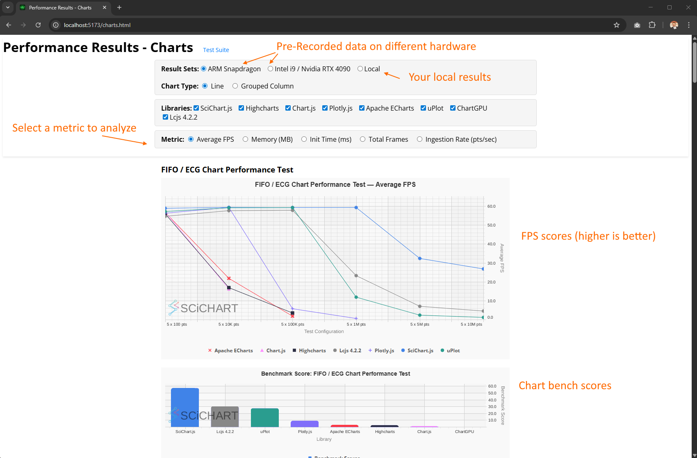

## Running tests automation via Playwright

**EXPERIMENTAL** 

The automated test solution runs the app and opens each test case sequentially.
At the end of each test case it screenshots the page with results in the table and saves them as PDF.  
After all test cases were executed the final "Results Summary" test in suite takes a PDF snapshot of the final results table at main app page.

**Prerequisites**
Playwright setup: `npx playwright install`

**How to run**

- `npm run test` - default runs tests in headless mode
- `npm run test:headed` - runs tests in headed mode
- *Playwright UI Mode*: run either of scripts with `-- --ui`, e.g. `npm run test:headed -- --ui`

Playwright outputs PDFs with results and also a JSON file that can be imported via the UI to visualise results in tables/charts.

## Modifying the Test Suite 

### Adding a new Test Case

1. Create a test type by updating G_TEST_GROUP_NAME in `public/before.js`. For example `CANDLESTICK_PERFORMANCE_TEST`
2. Add test group record to `G_TEST_GROUPS`. For example

```javascript
const G_TEST_GROUPS = {
    ...
    5: {
        name: G_TEST_GROUP_NAME.CANDLESTICK_PERFORMANCE_TEST,
            tests: [
            {
                series: 1,
                points: 1000,
                testDuration: 5000,
            },
            ...
            ]
        }
    }
}
```
3. Create a test function for each test group in the suite. For example `eCandlestickPerformanceTest` in `scichart.js`
4. Update select test if/else statement in `public/after.js`. For example

```javascript
if (testGroupName === G_TEST_GROUP_NAME.CANDLESTICK_PERFORMANCE_TEST) {
    perfTest = eCandlestickPerformanceTest(seriesNumber, pointsNumber);
}
```

4. Update `generateCharts()` function in `public/main.js` file to add new tests to the index page.

### The order of method calls

For any performance test, for example for eLinePerformanceTest, the order of calls is as follows:

1. `createChart` creates a chart
2. `generateData` generates data
3. `appendData` appends data
4. `updateChart` updates the chart
5. `deleteChart` deletes the chart


